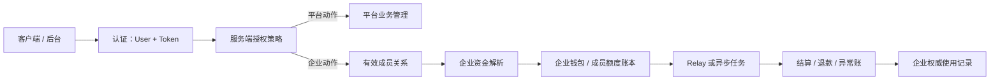
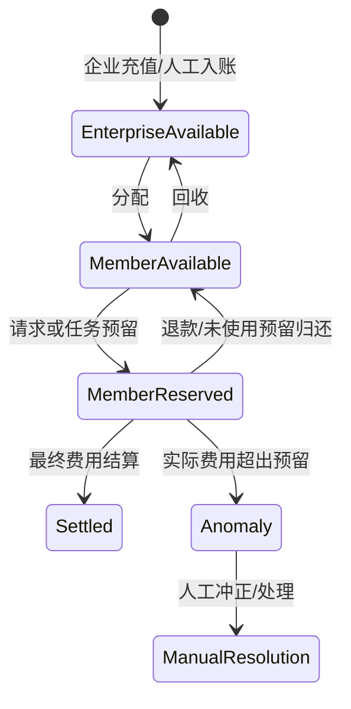

# 企业账户、角色、计费与 API Key 技术设计

**Author:** Codex

**Date:** 2026-08-17

**Status:** IN_REVIEW（L2 技术设计已通过结构校验；企业关系启用仍受发布门约束）

关联产品规格：[企业账户、角色、计费与 API Key 产品规格](../product-specs/enterprise-accounts-and-billing.md)

关联执行计划：[企业账户、角色、计费与 API Key：执行计划](../exec-plans/active/2026-08-17-enterprise-accounts-and-billing.md)

版本：v1.0

日期：2026-08-17

## Context（背景、目标与设计结论）

当前系统以 `User.Role` 表示平台数值角色、以 `User.Quota` 表示个人钱包、以 `Token.RemainQuota` 表示 Key 配额；这些对象不能安全地同时表达企业所有权、成员关系和真实企业资金。现有 Relay 只解析个人钱包/订阅资金来源；日志还可写入独立日志库或 ClickHouse。因此，企业计费不能通过给现有消费日志临时追加字段或复用 Token 余额实现。

本设计采用四条独立事实链：平台身份、企业成员关系、企业资金账本和 API Key 凭据。企业管理员仅是企业 `OWNER`，绝不提升为平台 `ADMIN`。企业钱包和成员额度构成独立的、不可变流水支持的计费主体；个人资产在有效企业关系期间保持冻结且不可作为企业调用回退来源。API Key 仍属于用户，企业成员的 Key 自设上限只是第二道自我约束，不是企业资产。

### 设计目标

1. 用服务端成员关系完成企业授权；前端视图、客户端的企业 ID 和 Token 可编辑配额均不是授权或企业账务来源。
2. 企业钱包、成员可用额度、成员在途额度、使用记录和账本在单主库事务中一致；任何重试不产生双扣或双退。
3. 同步 Relay 和异步任务均保留创建时企业计费快照，成员退出后仍能归属原企业并正确退款。
4. Root 与 Admin 的业务管理授权可显式平级，但同级身份/认证资料仍保持不可互改。
5. API Key 定向轮换保留原 Token ID 与策略，轮换后以可靠的全账户会话撤销换取正确性；邮件失败进入可审计待交付。

### 初始非目标

- 首版不提供企业订阅、企业多 Owner、跨企业成员关系、企业间转账、成员自行选择个人/企业付款或企业代管成员 Key。
- 首版不将企业账务权威信息放入 `model.Log`，不要求 ClickHouse 迁移。
- 不把管理/企业视图升级成安全边界；Root/Admin 切换视图后继续具有平台能力是已接受产品风险。
- 不改变 Root/Admin 任意有效 Key 可登录后台的已接受风险。

### 1.1 企业关系启用发布门

`Enterprise`、`EnterpriseMembership` 和 `User.active_enterprise_id` 仅是持久化基础，**不是**可立即启用的企业计费能力。当前个人 Relay、钱包、订阅、Token 额度与支付回调尚未读取企业关系；若先创建 `ACTIVE` Owner/Member，会让企业关系用户继续走个人钱包或个人订阅，违反“企业调用绝不回退个人资产”的产品边界。

因此，下列四项必须作为同一发布门生效，任何一项缺失时不得公开 Owner 指派、企业邀请接受、成员暂停/恢复或企业成员管理路由：

1. 企业钱包、真实划转和不可变账本可用；
2. 同步 Relay 与异步任务都使用企业预留、结算、退款及异常账快照；
3. 有效企业关系用户的个人资产冻结，且个人充值/订阅购买/续费由后端拒绝；
4. Owner 指派和企业邀请接受在同一事务中完成冻结、关系创建和锚点占用。

在发布门满足前，已存在的 Root/Admin Owner 基础关系也不得切换其实际调用资金来源；调用继续走兼容个人路径仅表示“企业能力未启用”，不能宣称已达到企业计费产品行为。缺失企业关系时，未来启用后的 Root/Admin 调用必须拒绝，不能回退个人钱包。

## Architecture and Trust Boundaries（架构与信任边界）



### 2.1 不可被信任的输入

- `enterprise_id`、成员 ID、Token 的 `RemainQuota` / `UnlimitedQuota`、前端视图、请求的资金来源、异步任务回调和上游扣费数值均是不可信输入。
- 服务端必须从当前认证用户与目标 Token 解析有效 `EnterpriseMembership`；若请求携带企业 ID，只能用于校验，不能决定企业或账本行。
- 企业管理员管理成员时，所有被管理对象查询必须同时带当前 Owner 的 `enterprise_id`。不能先按成员 ID 查出再在内存里判断。

### 2.2 平台身份与企业身份

```text
User.Role                  = ROOT | ADMIN | USER
EnterpriseMembership.Role  = OWNER | MEMBER
EnterpriseMembership.State = ACTIVE | PAUSED | DRAINING | MANUAL_REVIEW | RECLAIMED | REMOVED
```

`User.Role` 沿用现有数值角色，以免错误地用 `role >= ADMIN` 让企业 Owner 获得平台权限。新增命名策略函数区分：

- `PlatformBusinessAdmin`：Root 与 Admin 都可访问的渠道、模型、用户、兑换码、订阅、系统信息/设置等业务能力。
- `RootGovernance`：初始化、灾难恢复、根密钥读取等仍明确要求 Root 的治理能力；每条路由必须显式归类，不能通过全局降低 `RootAuth` 门槛完成平级化。
- `EnterpriseOwner`、`EnterpriseMember`：从关系表判断，不读取或比较 `User.Role`。

同级 Root/Admin 身份保护在服务层的目标用户操作策略中处理：若操作者和目标均为 Root/Admin，则拒绝修改目标的角色、邮箱、密码、Passkey、2FA、OAuth 绑定、Token、会话和全局状态。该规则不得仅依赖前端隐藏按钮。

## Data Models（持久化模型）

所有以下模型写入主数据库。时间字段沿用项目的 Unix 秒 `int64`；金额/额度统一使用现有 quota 整数单位，所有计算使用 `common` 的饱和转换工具，禁止裸 `int(float64(...))` 转换。

### 3.1 `Enterprise`

| 字段 | 类型 | 约束与含义 |
| --- | --- | --- |
| `id` | int | 主键 |
| `name` | varchar(100) | 企业显示名；用户输入需校验 |
| `owner_user_id` | int | 普通唯一索引；一个 Owner 只能拥有一个自动企业 |
| `status` | int | `ACTIVE` / `CLOSING` / `CLOSED` |
| `available_quota` | int | 可分配企业余额；不得为负 |
| `reserved_quota` | int | Owner 同步/异步调用预留；不得为负 |
| `anomaly_quota` | int | 已确认但未扣资产的异常账累计；不得为负 |
| `created_at`、`updated_at`、`closed_at` | int64 | 审计时间 |

企业钱包只存汇总余额；一切变动必须同时生成 `EnterpriseLedger`。不得复用 `User.Quota`。`owner_user_id` 的普通唯一索引兼容 SQLite、MySQL、PostgreSQL，不使用 partial unique index。

### 3.2 `EnterpriseMembership`

| 字段 | 类型 | 约束与含义 |
| --- | --- | --- |
| `id` | int | 主键 |
| `enterprise_id`、`user_id` | int | 联合唯一索引；查询必须使用二者限定 |
| `role` | int | `OWNER` 或 `MEMBER` |
| `status` | int | 生命周期状态；只有 `ACTIVE` 可创建企业资助调用 |
| `available_quota` | int | 已真实划转、未预留的成员额度；不得为负 |
| `reserved_quota` | int | 已为请求/任务预留的成员额度；不得为负 |
| `self_key_limit` | int | 成员对当前 Key 的总自限；必须在 `[0, available + reserved]` 范围内 |
| `self_key_used_quota` | int | 本 Key 已实际消耗的自限计数；不得为负 |
| `self_key_reserved_quota` | int | 已为在途调用占用的自限；不得为负 |
| `allow_ips` | text | Owner 设置的企业调用 IP 白名单；合并时只能收紧 Token 个人限制 |
| `joined_at`、`paused_at`、`draining_at`、`reclaimed_at`、`removed_at` | int64 | 生命周期审计 |

为兼容三数据库且保证“一人只在一个未结束企业”，给 `User` 增加 `active_enterprise_id int`，零表示无有效关系。在接受邀请、Owner 创建、暂停/排空和移除时锁定该 User 行并修改锚点；`EnterpriseMembership` 保留全部历史，不依赖跨库 partial unique index。有效 Owner、Member、Paused、Draining、Manual Review 都占用该锚点；仅在 `REMOVED` 后释放。SQLite 竞争路径必须使用 `active_enterprise_id = 0` 的条件更新并检查 `RowsAffected == 1`，失败者回滚；`(enterprise_id, user_id)` 联合唯一索引用于阻止重复成员行。

一个企业唯一 Owner 由 `Enterprise.owner_user_id` 保证，并在创建/转换时同事务创建 Owner 成员行。删除 Owner/关闭企业和未来所有权转移均必须先锁 Enterprise 与 Owner Membership；首版没有所有权转移接口。

### 3.3 `EnterpriseInvitation`

| 字段 | 类型 | 约束与含义 |
| --- | --- | --- |
| `id` | int | 主键 |
| `enterprise_id`、`inviter_user_id` | int | 索引；邀请者必须为该企业 Owner |
| `target_email` | varchar(255) | 规范化后比较；不写完整 Key |
| `expected_role` | int | 首版固定 `MEMBER`，仍需持久化，禁止由接受方提升 |
| `status` | int | `PENDING` / `ACCEPTED` / `REVOKED` / `REJECTED` / `EXPIRED` / `CONFLICTED` |
| `auth_flow_id` | int | 绑定短期、一次性接受流程 |
| `accepted_user_id` | int | 接受后固化；可为空 |
| `expires_at`、`created_at`、`accepted_at`、`revoked_at`、`rejected_at` | int64 | 状态审计 |

注册邀请与企业邀请是不同模型/用途。企业邀请可指向现有用户，也可在接受时建立用户；新用户场景将“校验接受流程、创建 User、创建唯一主 Key、消费邀请、创建成员关系、冻结个人资产、设置 `active_enterprise_id`”置于同一主库事务。创建 User 复用既有新用户默认值：当 `QuotaForNewUser > 0` 时，该额度写入 `User.Quota`，仍是该用户的个人资产，不得转入 `EnterpriseWallet` 或 `EnterpriseMembership` 额度；有效企业关系期间由资金来源与个人支付拒绝路径冻结，Owner 不可见、不可回收。邮件发送不在该事务内；只发送不含 Key 的邀请链接。

### 3.4 `EnterpriseLedger`

账本是企业资金真相，追加写入、不可更新、不可删除。建议字段如下：

| 字段 | 类型 | 约束与含义 |
| --- | --- | --- |
| `id` | int64 | 主键 |
| `enterprise_id`、`membership_id` | int | 归属；`membership_id` 可空用于企业直接资金 |
| `kind` | varchar(40) | `TOPUP`、`ALLOCATE`、`RECLAIM`、`RESERVE`、`SETTLE`、`REFUND`、`ANOMALY`、`ADJUSTMENT`、`REVERSAL` |
| `enterprise_available_delta`、`enterprise_reserved_delta` | int | 企业余额变动 |
| `member_available_delta`、`member_reserved_delta` | int | 成员余额变动 |
| `amount` | int | 本条动作的正向额度；不得为负 |
| `actor_user_id` | int | 操作者，系统动作为 0 或专用系统标识 |
| `reference_type`、`reference_id` | varchar(40)、varchar(128) | 请求、任务、订单、退款或人工处理引用 |
| `idempotency_key` | varchar(191) | 全局唯一索引；重复提交返回原结果 |
| `request_id` | varchar(64) | 请求关联；索引 |
| `reason` | varchar(255) | 人工调额、异常等说明 |
| `created_at` | int64 | 创建时间 |

汇总余额更新与对应账本行必须在同一事务。人工调账绝不覆盖旧账，使用 `ADJUSTMENT`/`REVERSAL` 新行；产品允许 Root/Admin 调整自己的企业，无需人为阻断，但必须记录操作者与受益企业。

### 3.5 `EnterpriseUsageRecord`

该表是企业账单、成员用量和后续退款的主库权威事实，不扩展 `model.Log`。建议字段：

`id`、`enterprise_id`、`membership_id`、`actor_user_id`、`token_id`、`idempotency_key`、`request_fingerprint`、`request_id`（仅关联索引）、`task_id`、`billing_account_id`、`allocation_id`、`funding_source`、`membership_role_snapshot`、`state`、`reserved_quota`、`settled_quota`、`refunded_quota`、`anomaly_quota`、`model_name`、`channel_id`、`created_at`、`settled_at`、`refunded_at`。

`request_id` 只作网关关联，不能作为企业扣费幂等键：现有中间件会为每个 HTTP 请求生成新的请求 ID。同步企业调用必须使用认证 Token 绑定的、由客户端稳定重试的 `Idempotency-Key`；数据库唯一键为 `token_id + idempotency_key`，并同时保存不可变的请求语义摘要。相同 Key 配不同摘要返回冲突；相同 Key 在 `PENDING` 时返回 `REQUEST_IN_PROGRESS`，在已结算/退款时只返回原使用记录摘要，**不会再次调用上游或尝试重放流式响应**。没有该头的企业资助调用在进入 Relay 前返回 400。异步任务使用独立的 `task:<task-id>` 幂等键。可在现有 `Log.Other` 写入非敏感关联 ID 方便展示，但 `Log` 和 ClickHouse 均不是企业资金权威来源。

本设计不新增泛化的 BillingAccount/Allocation 模型：`billing_account_id` 在企业路径固定等于 `Enterprise.ID`；成员的 `allocation_id` 固定等于稳定的 `EnterpriseMembership.ID`，Owner 为 `0`。两者是使用记录与任务快照中的冗余关联字段，不得根据当前归属重新计算。

### 3.6 `APIKeyDelivery`

| 字段 | 类型 | 约束与含义 |
| --- | --- | --- |
| `id` | int | 主键 |
| `user_id`、`token_id` | int | 轮换目标；不保存完整 Key 副本 |
| `email` | varchar(255) | 已验证绑定地址的快照 |
| `status` | int | `PENDING_DELIVERY` / `DELIVERED` / `FAILED_DELIVERY` |
| `idempotency_key` | varchar(191) | 唯一；重发同一 Key 使用同一记录 |
| `attempts`、`next_attempt_at`、`last_error_code` | int、int64、varchar(64) | 受控重试，不记录 SMTP 原始响应或 Key |
| `created_at`、`delivered_at` | int64 | 审计 |

Token 本体是唯一的新 Key 存储位置；投递任务在权限受控的发送路径中读取 Token Key，严禁将 Key 写到普通日志、错误、URL、列表接口、审计详情或任务参数。SMTP 成功提交后标记 `DELIVERED`；最终失败是明确接受风险，保持旧 Key 已失效并允许重发同一新 Key，禁止再轮换。

### 3.7 兼容字段与任务快照

- `User.active_enterprise_id`：一人一有效企业的事务锚点。
- `UserSubscription`：新增冻结状态、冻结起点和可恢复时间字段；冻结/解冻必须幂等。解冻时按冻结时长顺延结束和周期重置时间，期间不消费、不续费、不重置周期。
- 企业支付订单：在现有订单模型可兼容处增加 `billing_subject_type`、`billing_subject_id` 与 `enterprise_id` 快照；若现有回调无法安全区分，创建最小企业订单模型并只让企业充值走新路径，不能把企业款记入 `User.Quota`。
- `Task.PrivateData`：新增企业快照（企业、成员、账务账户、分配、Token、请求、资金来源、成员角色和使用记录 ID），在任务创建时写入；任务结算/退款不得重新查当前成员关系决定归属。

## Consistency and State Machines（一致性、锁与状态机）

### 4.1 事务和锁顺序

企业资金或关系状态变更都在主库事务中进行，按稳定顺序锁定：`User`（按 ID 升序）→ `Enterprise` → `EnterpriseMembership` → 相关 `EnterpriseUsageRecord`。MySQL/PostgreSQL 使用项目的 `lockForUpdate(tx)`；SQLite 使用事务与带状态条件的更新，不发送不支持的 `FOR UPDATE`。所有变更前验证状态、余额、所有权和幂等键。新建或升级为 Root/Admin 时，必须在写入该平台角色的同一主库事务中建立或修复 Enterprise、Owner Membership 和 `active_enterprise_id`；启动迁移回填只能处理既有账户，不能替代该运行时路径。

不得依赖 Redis/缓存完成资金正确性。缓存仅能作为 Token/用户读取加速；企业资金成功提交后再失效或发布缓存。任何缓存失败不能回滚已提交账本，必须留下可重试的失效任务或安全地从 DB 读取。

### 4.2 资金状态机



Owner 调用直接在 `Enterprise.available_quota` 与 `Enterprise.reserved_quota` 间移动；Member 调用同时在 Membership 的 available/reserved 和 `self_key_limit` 的 used/reserved 计数中移动。成员路径永远不调用个人 `WalletFunding`、个人订阅或 `TryReserveTokenQuota`；也必须禁用 `BillingSession.shouldTrust` 旁路。

### 4.3 同步调用预留与结算

1. 认证成功后校验 `Idempotency-Key`、解析 Token 的所有者和当前有效关系，生成不可由客户端篡改的 `EnterpriseBillingSnapshot`。
2. 如果用户是 Owner，锁企业；如果是 Member，锁企业和该成员。只有 `ACTIVE` 的 Member 可发起企业调用；Owner 需要企业为 `ACTIVE`。
3. 以 `token_id + idempotency_key` 查 `EnterpriseUsageRecord`。已有完成或预留记录按幂等规则返回，不二次扣款，也不二次调用上游。
4. 计算预扣费时执行现有输入上限与 `Quota*Checked` 规则。余额不足、成员暂停、Key 自限不足时拒绝，且不写任何余额变化。
5. 在同一事务中写汇总余额、`RESERVE` 账本和 `PENDING` 使用记录；成功后才调用上游。
6. 最终实际费用不超过预留时，写 `SETTLE`，将未用预留退回可用余额；相等时只改变状态。退款同理并按使用记录幂等。
7. 实际费用超过预留时，最多结算已预留额度；超出的正数写 `ANOMALY` 和使用记录，不扣个人资产、不写负余额，并将该 Member 立即转为 `PAUSED`（Owner 异常则暂停该企业企业调用）。人工处理只追加冲正/调账行。

所有 `amount` 都先验证非负、有限、在 quota 列上限内。预扣不足必须在上游调用前失败，不能依赖后置结算补扣。

### 4.4 异步任务、排空与移除

创建异步任务时将第 4.3 步的快照和 `EnterpriseUsageRecord.ID` 写入 `Task.PrivateData`。后续回调、超时、失败、人工退款都以这个快照锁定原企业/成员/使用记录结算，不读取当前用户归属或个人资金。企业结算实现必须是独立事务路径：现有个人 `BillingSession` 先后分开调整资金/Token、退款还依赖进程内异步任务，不能套用到企业资金。

成员移除为：`ACTIVE -> PAUSED -> DRAINING -> MANUAL_REVIEW | RECLAIMED -> REMOVED`。`MANUAL_REVIEW` 是持久状态，仍占用用户企业锚点，并继续拒绝新的企业资助调用。

1. Owner 发起移除时先暂停成员企业调用；不改变 `User.Status`，登录、邮箱验证和 Key 重置仍可用。
2. 进入 `DRAINING` 后拒绝新企业预留，等待该成员所有 `PENDING` 使用记录、异步任务、预扣、退款和结算结束。
3. 只有已清零 `reserved_quota` 后，才能将未消费 `available_quota` 回收至企业，生成 `RECLAIM` 账本，标记 `RECLAIMED` 与 `REMOVED`，并释放 `User.active_enterprise_id`。
4. 达到配置的排空时限进入人工处理，不得强制移除。迟到退款若成员额度仍开启则退成员额度；若已经关闭则退原企业 `available_quota`；绝不退个人钱包。

## API Contracts（API 与授权契约）

所有端点均使用现有统一响应包裹和认证中间件；以下为资源和错误语义，最终 DTO 应置于 `dto/`。接口命名为设计建议，在第一片路由实现前需与仓库既有 API 命名规则核对，但权限和状态契约不可改变。

```ts
interface EnterpriseAllocationRequest {
  amount: number; // 正整数 quota；服务端做饱和上限校验
  idempotency_key: string; // Owner 资金动作的稳定幂等键
}

interface EnterpriseCallHeaders {
  "Idempotency-Key": string; // Token 绑定；企业资助调用必填
}

interface EnterpriseSummaryResponse {
  enterprise_id: number;
  membership_id: number;
  membership_role: "OWNER" | "MEMBER";
  membership_status: "ACTIVE" | "PAUSED" | "DRAINING";
  available_quota: number;
  reserved_quota: number;
}

interface EnterpriseErrorResponse {
  success: false;
  code: string;
  message: string; // 不含 Key、外部凭据或跨企业存在性信息
}
```

### 5.1 企业自助与 Owner 管理

| 方法与路径 | 角色 | 请求/结果 | 关键拒绝 |
| --- | --- | --- | --- |
| `GET /api/enterprise/self` | Owner/Member | 当前企业、本人成员状态、可见余额摘要 | `ENTERPRISE_MEMBERSHIP_NOT_FOUND` |
| `GET /api/enterprise/members` | Owner | 本企业成员分页列表（不含个人资产/完整 Key） | `ENTERPRISE_OWNER_REQUIRED` |
| `POST /api/enterprise/invitations` | Owner | 邮箱、可选新用户名；创建企业邀请 | `ENTERPRISE_INVITATION_CONFLICT`、`USER_ALREADY_IN_ENTERPRISE` |
| `DELETE /api/enterprise/invitations/:id` | Owner | 仅撤销本企业待接受邀请 | `ENTERPRISE_RESOURCE_NOT_FOUND` |
| `POST /api/enterprise/members/:id/allocation` | Owner | `amount`、`idempotency_key`；真实划转 | `ENTERPRISE_INSUFFICIENT_QUOTA` |
| `POST /api/enterprise/members/:id/reclaim` | Owner | `amount` 或全部未用余额、幂等键 | `MEMBER_QUOTA_RESERVED` |
| `POST /api/enterprise/members/:id/pause` / `resume` | Owner | 暂停/恢复企业资助调用 | `INVALID_MEMBERSHIP_STATE` |
| `PUT /api/enterprise/members/:id/whitelist` | Owner | IP/CIDR 列表；替换企业白名单 | `INVALID_IP_ALLOWLIST` |
| `POST /api/enterprise/members/:id/remove` | Owner | 开始暂停/排空/移除；返回状态 | `MEMBER_DRAINING`、`MEMBER_MANUAL_REVIEW_REQUIRED` |
| `GET /api/enterprise/wallet`、`/ledger`、`/usage` | Owner | 企业余额、流水、账单快照 | `ENTERPRISE_OWNER_REQUIRED` |

Member 只能读取自己的摘要和企业资助调用记录。Owner 不得从任何这些接口获取成员个人钱包、订阅、完整 Key、认证信息或跨企业资料。

### 5.2 平台业务与企业 Owner 指派

`POST /api/user/:id/enterprise-admin` 由 `PlatformBusinessAdmin` 调用。服务端锁定目标用户，确认其是普通平台用户且 `active_enterprise_id=0`，原子创建企业、Owner 关系、个人资产冻结与锚点；如果用户已有未结束关系，返回 `USER_ALREADY_IN_ENTERPRISE`。该接口绝不写 `User.Role=ADMIN`。此接口在“企业关系启用发布门”满足前不得注册为公开路由。

Root-only 路由必须分三类清单审阅：

1. 业务管理：可迁移到 `PlatformBusinessAdmin`，例如产品明确列出的渠道、模型、用户、兑换码、订阅、系统信息、系统设置。
2. 敏感业务动作：可以平级但要保留既有二次验证、审计和命名权限，例如渠道密钥读取、敏感写入；不能仅降低 `RootAuth`。
3. 平台治理：初始化、根身份生命周期、灾难恢复和非业务密钥治理继续为 `RootGovernance`。未分类的 Root 路由保持 Root，不做猜测性放开。

#### 5.2.1 当前 Root-only 路由事实清单（2026-08-17）

以下是对当前路由源码的只读盘点，不是把 Root-only 路由自动降级为 Admin 的授权。`AdminAuth` 允许 Root 和 Admin，`RootAuth` 仅允许 Root；所有候选平级化都仍须保留现有细粒度权限、二次验证、审计、幂等和账务约束。

| 当前 Root-only 路由 | 源码事实 | 候选类别与结论 |
| --- | --- | --- |
| `POST /api/channel/:id/key` | 返回完整上游渠道 Key，现有二次验证和审计 | 敏感业务动作；若允许 Admin，必须显式接入 `ChannelSecretView` 与现有安全验证，不能只移除 `RootAuth`。 |
| `GET/PUT /api/option/` | 读取或写入任意全局 Option key；其中混有认证、支付、定价、模型路由、页面和运行参数 | `GET` 为平台治理；`PUT` 为 **UNKNOWN**，必须先按 key 建权限白名单或拆分端点，禁止整体降级。 |
| `/api/option/payment_compliance`、`channel_affinity_cache` | 支付合规确认、全局缓存统计与清理 | 平台治理。 |
| `/api/option/rest_model_ratio`、`waffo-pancake/*` | 重置全局倍率，或查询/创建/保存外部支付商产品、私钥和回调配置 | 敏感业务动作；Root/Admin 是否均可执行待人工确认。 |
| `/api/custom-oauth-provider/*` | 全局登录身份提供商和凭据的发现、读写、删除 | 平台治理。 |
| `/api/performance/*` | 进程/磁盘/缓存/日志元信息、清缓存、强制 GC、删除日志 | 平台治理。 |
| `/api/ratio_sync/*` | 读取可同步渠道或请求外部上游拉取倍率 | 敏感业务动作；必须保留外部地址与渠道凭据边界。 |
| `/api/system-task/*`、`/api/system-info/*` | 系统任务、运行节点和过期实例记录管理 | 平台治理；当前“系统信息”产品菜单不等同于可修改节点生命周期。 |

产品列出的渠道、模型、用户、兑换码、订阅、系统信息、系统设置对应的当前代码边界如下：

- 渠道管理已使用 `AdminAuth` 和细粒度渠道权限；新增/删除/修改敏感配置与读取完整 Key 不是普通 Admin 默认能力。
- 模型元数据、兑换码及常规用户列表/搜索已是 `AdminAuth`；用户升降级、管理员权限配置、额度调整、补单、禁用/删除属于治理或敏感业务动作，不能由菜单可见性决定。
- 订阅管理已是 `AdminAuth`，但套餐变更、绑定、失效、删除、重置会影响账务，候选为敏感业务动作，Root/Admin 是否完全平级待人工确认。
- `/system-settings/site` 最终使用 `/api/option`，因此在有 key 分类前不得因前端页面名称整体开放给 Admin。

站点设置的前端实际读写 key 已盘点。若产品确认 Root/Admin 在“站点设置”平级，建议新增受限的 `GET/PUT /api/option/site`，仅允许下列 key，原 `GET/PUT /api/option` 继续 `RootGovernance`：

```text
SystemName
Logo
Footer
About
HomePageContent
Notice
legal.user_agreement
legal.privacy_policy
HeaderNavModules
SidebarModulesAdmin
```

`HeaderNavModules` 与 `SidebarModulesAdmin` 只改变界面展示，绝不改变后端授权。`ServerAddress` 必须保持 Root-only：它参与 OAuth 回调、Webhook、重置链接和 Passkey 等运行链路。认证、SMTP、支付/订阅/企业计费、倍率/模型路由、渠道自动策略、运行/性能和安全设置也必须保持 Root-only。`Chats`、任务/绘图开关、货币/额度展示、`console_setting.*` 等不能仅按名称归为站点设置，当前为 `UNKNOWN`，不得提前加入白名单。

该受限路由是已确认的产品范围；实现时必须保留显式后端 key 白名单，不能通过前端隐藏模拟。完整渠道 Key 仍仅 Root 可查看。

本清单确认了现有事实，但不替代逐路由的产品授权。未获得明确结论的 Root-only 路由保持 Root-only。

### 5.3 Key 重置和投递

普通用户/Owner/Member 的主 Key 重置请求不接受可任选 Token ID；服务端取唯一有效主 Key。Root/Admin 的重置流程先验证绑定邮箱所有权，再返回掩码 Token 列表与短期选择凭据；确认时目标 Token 必须属于该用户且与选择流程绑定，不能凭邮箱和 Token ID 触发。

轮换事务：锁 User 和目标 Token → 再次验证角色/唯一性/选择流 → 原 Token 记录原地更新新 Key、保留 ID/名称/额度/用量/限制/白名单/历史关系 → 递增 `AuthVersion` → 创建 `APIKeyDelivery(PENDING_DELIVERY)`。提交后投递明文 Key 邮件。任何失败只能重发该投递记录绑定的同一 Key；不得创建新 Key。由于 `UserSession` 当前无 Key 来源，首版每次 Key 轮换撤销该用户全部会话。

所有 Key 响应、邮件状态和审计只显示 Token ID、掩码和状态；完整 Key 仅在受控邮件正文和短暂发送函数内存在。企业管理员不得为成员读取、选择或接收 Key。

### 5.4 统一错误码

| 错误码 | HTTP | 含义 |
| --- | --- | --- |
| `ENTERPRISE_MEMBERSHIP_NOT_FOUND` | 403 | 当前用户没有可用企业关系 |
| `ENTERPRISE_OWNER_REQUIRED` | 403 | 非 Owner 访问 Owner 资源 |
| `ENTERPRISE_RESOURCE_NOT_FOUND` | 404 | 资源不在当前企业范围内或不存在 |
| `USER_ALREADY_IN_ENTERPRISE` | 409 | 用户已有未结束企业关系 |
| `ENTERPRISE_INVITATION_CONFLICT` | 409 | 邀请已处理、失效或并发冲突 |
| `MEMBERSHIP_PAUSED` | 403 | 成员仅被禁止企业资助调用 |
| `MEMBER_DRAINING` | 409 | 成员正在排空，不能分配/恢复新调用 |
| `MEMBER_MANUAL_REVIEW_REQUIRED` | 409 | 排空超时，必须人工处理 |
| `ENTERPRISE_INSUFFICIENT_QUOTA` | 402 | 企业或成员真实可用额度不足 |
| `MEMBER_QUOTA_RESERVED` | 409 | 试图回收在途预留额度 |
| `KEY_RESET_SELECTION_INVALID` | 403 | Root/Admin 的 Key 选择流程无效 |
| `KEY_DELIVERY_PENDING` | 202 | Key 已轮换，待交付或允许受控重发 |

## Migration and Rollout（迁移与上线策略）

### 6.1 迁移顺序

现有 `migrateDBFast()` 不保证模型依赖顺序。企业模型、User 新列、索引和 Root/Admin 回填进入确定性迁移步骤，不能只依赖并行 AutoMigrate。每项 DDL 要兼容 SQLite、MySQL >= 5.7.8、PostgreSQL >= 9.6，避免 JSON 专有列、partial index、SQLite 不支持的 `ALTER COLUMN` 和未分支的原生 SQL。

建议顺序：

1. 添加 `User.active_enterprise_id` 和订阅冻结兼容字段（零值/空值按既有个人用户语义处理）。
2. 创建 Enterprise、Membership、Invitation、Ledger、UsageRecord、APIKeyDelivery 及普通索引/唯一索引。
3. 为已有 Root/Admin 幂等补建独立企业与 Owner 成员关系，锁用户并检查 `active_enterprise_id`/`owner_user_id`，重复运行不生成第二企业。
4. 只读校验：每个 Root/Admin 恰有一个 Owner 企业；没有 User 同时指向两个未结束关系；企业汇总与初始账本可对账。
5. 开启企业能力前，先保持个人调用原路径；Root/Admin 企业调用切换必须在企业钱包已有明确入账策略后进行。缺失关系时拒绝，不回退个人钱包。

不做破坏性历史数据回写，不迁移现有 `Log`。迁移前后都保留个人调用语义；回滚采取关闭新入口、停止新企业动作和前向数据修复，绝不删除账本/使用记录或回滚已执行的资金变动。

### 6.2 个人资产冻结

进入有效企业关系的用户，保留 `User.Quota` 和个人订阅记录，但资金来源解析器在企业调用时必须拒绝个人钱包和订阅；成员的充值、订阅购买、续费接口也在后端返回拒绝。企业邀请新建用户沿用 `QuotaForNewUser` 时，该默认赠额同样只写入冻结的 `User.Quota`，不进入企业钱包或成员额度。签到、兑换码、推广等若保留，仍只增加冻结的个人钱包。

离开企业后个人资产解冻。订阅按冻结时长顺延，不能因重复解冻多次顺延；加入/离开、续费、周期重置需锁用户与订阅记录并具备明确测试。

### PostgreSQL 主库迁移与隔离 UAT

项目已有 PostgreSQL 驱动与 `SQL_DSN` 选择逻辑，开发 compose 也已使用 PostgreSQL 15；这只证明应用能连接 PostgreSQL，**不**代表历史 SQLite/MySQL 数据已经可安全迁移。企业功能的账本、锁和幂等路径应以 PostgreSQL 为目标主库验证，同时不破坏现有三数据库支持。

迁移分为两个互不混淆的阶段：

1. **隔离 UAT 演练（本授权范围）**：从生产库取得一致性、只读快照，恢复到主机 158 上专属 PostgreSQL UAT 数据库；生产应用、数据库、卷、端口和配置不变。UAT 在恢复后运行凭据清洗和网络隔离，再做迁移与功能验收。
2. **生产 PostgreSQL 切换（不在本次授权范围）**：仅在 UAT 连续演练通过、运行窗口和独立备份已审批后，另行提出切换计划。不得把 UAT 成功视为已授权切生产。

迁移工具必须是可重复的离线导入工具，而不是让应用的 `AutoMigrate` 猜测性搬运数据：

1. 记录源库类型、版本、快照时间、表清单和只读校验摘要，但不将 DSN、密钥或真实数据写入仓库。
2. 在独立 PostgreSQL 数据库先创建应用 schema，再按依赖顺序导入全部主库表，保留原主键和时间字段；日志库若是独立库，单独列为迁移范围和验收项，不能静默遗漏。
3. 对每个使用序列的表按导入后的最大 ID 重置 PostgreSQL 序列；否则后续写入可能主键冲突。
4. 在源/目标分别校验表行数、关键聚合（用户余额、订单金额、订阅状态、Token/会话/任务数量）和抽样引用关系；任一不符即销毁 UAT 目标后重新演练，不向生产回写。
5. 恢复完成后、启动 UAT 应用前，使用只针对 UAT 数据库的受控清洗步骤：失效或替换真实 Token、渠道上游 Key、SMTP、支付、OAuth/OIDC、回调 URL 和管理员会话；建立单独的 UAT 管理账户。清洗清单必须逐表覆盖普通列和 JSON/TEXT 载体，至少包括 `tasks.private_data` 中可能保存的渠道 Key；清洗后再次扫描敏感列/JSON 载体并核对行数。任何清洗、扫描或隔离验证失败，销毁该 UAT 副本，不启动应用。不得让真实用户凭据在 UAT 有效。
6. UAT 应用使用独立 compose 项目、端口、网络、卷、PostgreSQL、Redis、环境文件和镜像标签，并在主机/容器网络策略中拒绝到生产地址及真实邮件、支付、OAuth、上游 AI 的出站访问。企业 E2E 仅使用合成账户和本地/模拟渠道。

如果主机 158 的生产数据库类型、备份方式、规模、可用磁盘、容器/服务编排或网络隔离不能从只读检查确认，则 PostgreSQL UAT 切片暂停并记录缺失事实；不以猜测的路径、端口、容器名或 DSN 操作。

## Security, Reliability and Observability（安全、可靠性与可观测性）

### 7.1 安全要求

- 企业授权不依赖前端、UI 菜单、视图或客户端企业 ID；所有查询按企业范围限定。
- 成员暂停只影响企业资助调用，不写 `User.Status`，不封禁平台身份。
- API Key、邮件正文、SMTP 凭据、支付密钥、完整回调数据不得进入日志、错误、指标标签、测试快照或仓库。
- Key 找回请求保持不可枚举；邮件所有权验证、限流、一次性流程和 Token 归属检查不可绕过。
- Root/Admin 平级不得演变为同级认证资料互改；每个受保护字段的更新路径都要统一策略审计。

### 7.2 可靠性要求

- 企业账务操作以唯一幂等键和 DB 事务实现至少一次调用下的有效一次账务结果；重复回调返回原记录。
- SMTP 发送使用持久化 outbox/投递记录与受控退避重试。外部 SMTP 不可与 DB 提交原子化是明确接受风险，必须能观测 `PENDING_DELIVERY` 与 `FAILED_DELIVERY` 数量。
- 异步任务、退款和人工处理不得依赖进程内 goroutine 唯一执行；企业路径需要持久化待结算/待退款状态与可重试调度。
- 企业使用记录、账本与成员余额的差异必须可定期对账；发现负余额、重复幂等键冲突或异常账增长应告警且保留请求关联 ID。

### 7.3 指标与审计

至少记录并按企业隔离展示：邀请创建/接受失败率、成员暂停数、排空超时数、企业可用/预留/异常余额、预留到结算差额、重复幂等命中、待投递/投递失败数、异常账金额、退款目标（成员/原企业）。所有账务行固化 `actor_user_id`、`enterprise_id`、`membership_id`、`billing_account_id`、`allocation_id`、`token_id`、`request_id`、`funding_source`、`membership_role_snapshot`。

## Traceability（产品功能到技术实现与验收追踪）

| 产品功能 | 技术实现 | 最小验收 |
| --- | --- | --- |
| 平台/企业身份分离与 Root/Admin 平级 | 命名授权策略 + Membership 关系，不加企业数值平台角色 | 给定 Owner 为 USER，调用平台接口被拒；Root/Admin 业务接口均可访问 |
| 同级认证信息保护 | 用户管理服务中目标身份字段策略 | Root/Admin 互改认证资料均被拒，自改保持可用 |
| Root/Admin 独立企业 | 确定性回填和调用前关系校验 | 重复迁移仅有一个企业；缺失关系拒绝调用 |
| 普通用户成为 Owner | 企业创建事务 + `active_enterprise_id` | 不改 `User.Role`；个人资产进入冻结 |
| 一人一企业、唯一 Owner | User 锚点 + Enterprise owner 唯一索引 + 锁 | 并发接受两邀请仅一条成功；Owner 不能直接退出 |
| 企业邀请 | 独立 Invitation/AuthFlow + 接受事务 | 新/旧用户均能接受；注册邀请不自动入企业 |
| 暂停/移除成员 | Membership 状态机和排空查询 | 暂停不封号；移除前回收可用额度且等待在途 |
| 企业钱包和真实划转 | Enterprise/Membership 汇总 + Ledger | 分配、预留、结算、回收可对账且无负数 |
| 成员 Key 自限 | Membership 自限计数，独立于 Token 额度 | 不能 Unlimited 或超成员可用；可自行调高/降低 |
| 企业调用不回退个人 | Enterprise Funding 分支，拒绝 Wallet/Subscription | 企业余额不足不扣 `User.Quota` 或订阅 |
| 异常超额和迟到退款 | UsageRecord 快照 + ANOMALY/REFUND 流水 | 异常不扣个人；移除后退款回原企业 |
| 个人资产/订阅冻结 | Funding resolver + 订阅冻结字段 | 加入期间不消费/续费/重置，离开后一次性顺延 |
| 单 Key 与定向轮换 | 角色化唯一性检查、原 Token 更新、AuthFlow | 普通用户单 Key；Admin 只轮换所选 Key |
| 邮件明文投递风险例外 | APIKeyDelivery outbox，Token 原记录读取 | SMTP 失败后旧 Key失效且只能重发同一新 Key |
| 历史账单稳定 | UsageRecord/Task 快照 | 成员移除或 Key 轮换后历史企业/成员归属不变 |

## Functional Requirements（功能需求）

- FR-1: 系统 MUST 用企业关系而不是 `User.Role` 表达企业管理员和成员。
- FR-2: 企业 API MUST 从当前认证身份解析有效关系，且所有 Owner 资源查询 MUST 限定当前企业。
- FR-3: 企业余额、成员额度和账本 MUST 在同一事务内更新，并且任何余额 MUST NOT 为负。
- FR-4: 企业调用 MUST NOT 使用个人钱包、个人订阅、Token 可编辑余额或信任额度旁路。
- FR-5: 成员移除 MUST 经过暂停、排空、回收和历史保留；超时 MUST 转人工处理。
- FR-6: 每个企业资助调用和任务 MUST 固化创建时企业账务快照，并以其结算/退款。
- FR-7: 普通用户/Owner/Member MUST 保持单主 Key；Root/Admin 定向轮换 MUST 只影响选定 Token。
- FR-8: Key 轮换 MUST 在提交后创建可重试投递记录，邮件失败 MUST NOT 重新轮换或恢复旧 Key。
- FR-9: Root/Admin 业务管理平级 MUST NOT 放宽同级身份、认证和会话修改。
- FR-10: 企业支付 MUST 以企业为计费主体，成员个人支付/订阅动作 MUST 被后端拒绝。
- FR-11: 企业资助调用 MUST 使用 Token 绑定的稳定幂等键；网关请求 ID MUST NOT 作为扣费幂等键。

## Non-Functional Requirements（非功能需求）

- NFR-1：SQLite、MySQL >= 5.7.8、PostgreSQL >= 9.6 的 schema 和核心事务路径 MUST 可运行或有明确兼容证据。
- NFR-2：账务重复提交 MUST 以幂等键返回同一结果，不重复写账或改余额。
- NFR-3：完整 API Key、SMTP/支付密钥 MUST NOT 出现在非受控响应、日志、审计、URL 或指标中。
- NFR-4：企业账务权威记录 MUST 不依赖独立日志库或 ClickHouse。
- NFR-5：UAT MUST 使用与生产不同的项目、端口、网络、卷、数据库、Redis 和环境文件；未取得隔离证据 MUST NOT 部署。
- NFR-6：PostgreSQL MUST 是本项目后续主数据库目标；从 SQLite/MySQL 导入时 MUST 保留主键与引用、重置序列、以一致性快照验证，并且生产切换 MUST 另行审批。
- NFR-7：包含生产数据的 UAT 副本 MUST 在恢复后清洗外部凭据、禁止访问生产地址和外发副作用；UAT 验收 MUST 只用合成账户和模拟/本地渠道。
- NFR-8：企业账务 MUST 在独立事务内原子写入企业汇总、成员汇总、账本和使用记录；现有个人 `BillingSession` 的异步退款/Token 调整顺序 MUST NOT 作为企业路径实现。

## Acceptance Criteria（验收条件）

### AC-1: 企业授权隔离(FR-1, FR-2)

Given 平台身份为 USER 的企业 Owner，When 其请求平台业务管理接口，Then 系统拒绝请求；Given 同一 Owner 管理成员，When 查询成员资源，Then 仅返回其企业范围内的资源。

### AC-2: 平台业务平级与同级保护(FR-1, FR-9)

Given Root 或 Admin，When 其调用已分类的业务管理接口，Then 双方按相同业务权限处理；Given 目标也是 Root/Admin，When 操作者修改其认证或身份字段，Then 系统拒绝。

### AC-3: 划转幂等和余额守恒(FR-3, NFR-2)

Given 并发的成员分配、回收或同一 `idempotency_key` 请求，When 事务完成，Then 全部余额非负、账本可对账且重复请求不产生第二笔流水。

### AC-4: 企业调用不回退个人资产(FR-4)

Given 企业成员的个人钱包或订阅有余额且成员企业额度不足，When 发起企业调用，Then 系统在调用上游前失败且个人资产不变化。

### AC-5: 移除成员先排空(FR-5, FR-6)

Given 成员有在途请求或任务，When Owner 请求移除，Then 成员进入 DRAINING；Given 所有结算和退款完成，When 移除继续，Then 先回收可用额度再移除；Given 排空超时，When 继续移除，Then 标记人工处理。

### AC-6: 迟到退款保持原企业归属(FR-6)

Given 成员移除后产生任务退款，When 退款执行，Then 系统依据任务快照退回仍开着的成员额度或原企业钱包，且绝不写入个人钱包。

### AC-7: Key 定向轮换(FR-7, FR-8, NFR-3)

Given 普通用户并发重置主 Key，When 事务成功，Then 仅有一条有效 Key；Given Root/Admin 选择一条 Key，When 轮换完成，Then 其余 Key 不变、全账户会话撤销且完整新 Key 不出现在接口或日志。

### AC-8: Key 待交付重发(FR-8)

Given 轮换事务已提交而 SMTP 最终失败，When 用户请求受控重发，Then 系统发送同一 Token Key，旧 Key 仍失效，且不出现第二次轮换。

### AC-9: 成员个人支付在后端拒绝(FR-10)

Given Member 访问充值、购买订阅或续费后端接口，When 请求到达服务端，Then 返回拒绝，即使前端菜单被手工构造。

### AC-10: UAT 部署和跨库门禁(NFR-1, NFR-4, NFR-5)

Given 每个候选发布，When SQLite 迁移/测试、PostgreSQL 兼容验证或 UAT 隔离清单未通过，Then 该候选不得进入 UAT 部署或生产发布。

### AC-11: PostgreSQL 快照迁移(NFR-6, NFR-7)

Given 获准的生产一致性只读快照，When 迁移工具恢复到独立 UAT PostgreSQL，Then 表主键、引用、关键汇总和序列校验通过；Given UAT 应用启动，When 它尝试使用生产凭据或连接生产网络，Then 被清洗配置和网络策略阻断。

### AC-12: 企业调用稳定幂等(FR-11, NFR-8)

Given 同一个 Token 和 `Idempotency-Key` 的网络重试，When 首次调用已处于 PENDING 或已结算，Then 系统不再次调用上游、不重复预留或结算；Given 同 Key 但请求摘要不同，When 请求到达，Then 返回冲突；Given 没有稳定幂等键，When 发起企业资助调用，Then 在 Relay 前返回参数错误。

## Edge Cases（边界情况）

- EC-1: 两个企业邀请被同一用户并发接受时，锁定 User 锚点，只有第一个成功，另一个标记冲突或失效。
- EC-2: 成员在预扣成功、上游尚未结束时被暂停，现有请求按快照结算，新请求拒绝。
- EC-3: 上游报出超过预留的费用时，仅结算预留，写异常账并暂停后续企业调用，不写负余额或个人扣款。
- EC-4: 任务回调重复、乱序或在成员移除后到达时，使用 `EnterpriseUsageRecord` 状态和幂等键处理一次。
- EC-5: SMTP 重试进程重启后从 `APIKeyDelivery` 继续；状态更新失败不得暴露 Key 或生成新 Key。
- EC-6: Root/Admin 降级时不删除企业，Owner 关系保留；全局禁用/删除 Owner 前拒绝或先完成企业关闭流程。
- EC-7: 企业支付回调重试时，按订单与企业计费主体快照幂等入企业，不记入 `User.Quota`。
- EC-8: 流式调用在客户端断开后以原幂等键重试时，系统只返回在途/已结算摘要，不重放或重复上游流；人工或客户端必须依现有查询能力处理结果可见性。

## Out of Scope（非目标、风险接受与待审阅项）

- OS-1: 首版不实施企业订阅、企业多 Owner、跨企业成员关系、企业间转账、成员付款来源选择或企业代管成员 Key；这些能力未进入产品规格。
- OS-2: 生产 PostgreSQL 切换、生产数据删除/清洗、生产容器重启和生产配置修改不属于本授权；仅设计并在隔离 UAT 演练。
- OS-3: UAT 不向真实邮件、支付、OAuth、上游 AI 或生产服务外发请求；如需真实外部 E2E，须另行指定测试账户和范围。

### 明确风险接受与待审阅项

1. Root/Admin 的企业视图不构成 API 权限降级边界；这是产品已接受风险。
2. Root/Admin 任意有效 Key 可登录后台；首版不处理。
3. 完整新 Key 直接以邮件明文交付；SMTP 与数据库提交非原子。通过投递状态、最小暴露和同 Key 重发降低影响，但不能消除邮件泄露风险。
4. Root-only 路由的源码事实清单已完成；其中敏感业务动作的 Root/Admin 平级授权、`/api/option` 的 key 分类、企业充值既有支付回调的确切接入点仍需人工审阅，不能猜测性补齐。
5. Relay/异步计费切片在现有请求 ID、个人 `BillingSession` 和任务退款实现上存在已证实的原子性差距；在 FR-11/NFR-8 的新契约通过实现审阅前，不得接入企业调用链。

## Implementation Slices（实施分片与完成定义）

实施顺序、独立分支和文档回写规则见[执行计划](../exec-plans/active/2026-08-17-enterprise-accounts-and-billing.md)。每个切片的完成定义为：对应 AC 的确定性测试通过、相关文档回写实际证据与 `NOT_RUN` 边界、独立分支可审阅且未修改其他切片所有权文件。任何实现中发现的产品外要求、公共 API 破坏、权限/计费不确定性或生产依赖，必须停止该片并更新本设计/执行计划后再继续。

当前执行状态：平台特权角色保护（`bc78a4b0e`）与企业基础 A（`a53cfbef2`）已受控整合。A 包含稳定幂等键、Root/Admin 原子补建、SQLite CAS/成员联合唯一、邀请/成员状态及旧 `users.active_enterprise_id` 补列回归；MySQL/PostgreSQL 企业模型实测为 `NOT_RUN`。P 只能作为合成清单格式校验器，不能证明真实快照清洗、全表导入/引用/序列正确性或 UAT 隔离。主机 158 已完成当前基线的隔离 PostgreSQL 演练与内部 HTTP 验证，但企业功能尚未部署，且 127.0.0.1:3002 未形成实际监听；详见[UAT 演练结果](../exec-plans/active/2026-08-17-postgres-uat-run-result.md)。企业关系启用必须等待 C、D、E 与 B 同批通过发布门；不得用“未注册路由”替代账务与资金来源边界。
